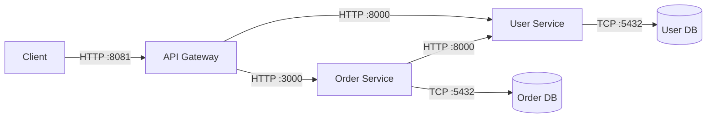

# Microservices Project

A simple microservices architecture demonstrating communication between services using an API Gateway, User Service, and Order Service.

## Overview

This project consists of three main services:

1.  **API Gateway** (Node.js/Express): The entry point for all client requests. It creates a unified API surface by routing requests to the appropriate backend services.
2.  **User Service** (Python/FastAPI): Manages user data and registration. Connected to a PostgreSQL database.
3.  **Order Service** (Node.js/Express): Manages order creation. It communicates with the User Service to validate users before creating orders. Connected to a separate PostgreSQL database.

## Architecture



## Tech Stack

- **API Gateway**: Node.js, Express, Axios
- **User Service**: Python, FastAPI, SQLAlchemy, Uvicorn, Pydantic
- **Order Service**: Node.js, Express, pg (node-postgres)
- **Databases**: PostgreSQL
- **Infrastructure**: Docker, Docker Compose

## Prerequisites

- [Docker](https://www.docker.com/) and Docker Compose installed.

## Getting Started

The easiest way to run the application is using Docker Compose.

1.  **Clone the repository** (if you haven't already).

2.  **Start the services**:

    ```bash
    docker compose up --build
    ```

    This will build the images and start all services and databases.

3.  **Access the API**:

    The API Gateway is available at `http://localhost:8081`.

### API Endpoints

| Method | Endpoint     | Description          | Payload Example                                 |
| :----- | :----------- | :------------------- | :---------------------------------------------- |
| `GET`  | `/health`    | Check Gateway status | N/A                                             |
| `POST` | `/users`     | Create a new user    | `{"name": "John", "email": "john@example.com"}` |
| `GET`  | `/users/:id` | Get user details     | N/A                                             |
| `POST` | `/orders`    | Create a new order   | `{"user_id": 1, "product_name": "Laptop"}`      |

### Testing with CURL

**Check Health**:

```bash
curl http://localhost:8081/health
```

**Create a User**:

```bash
curl -X POST http://localhost:8081/users \
  -H "Content-Type: application/json" \
  -d '{"name": "Alice", "email": "alice@example.com"}'
```

**Create an Order** (Requires valid `user_id`):

```bash
curl -X POST http://localhost:8081/orders \
  -H "Content-Type: application/json" \
  -d '{"user_id": 1, "product_name": "Headphones"}'
```

## Local Development (Optional)

If you wish to run services individually without Docker, you will need to:

1.  Ensure PostgreSQL databases (`user_service_db`, `order_service_db`) are running and accessible.
2.  Set environment variables (`DATABASE_URL`, `DB_HOST`, etc.).
3.  Install dependencies (`pip install -r requirements.txt`, `npm install`).
4.  Start each service manually.
